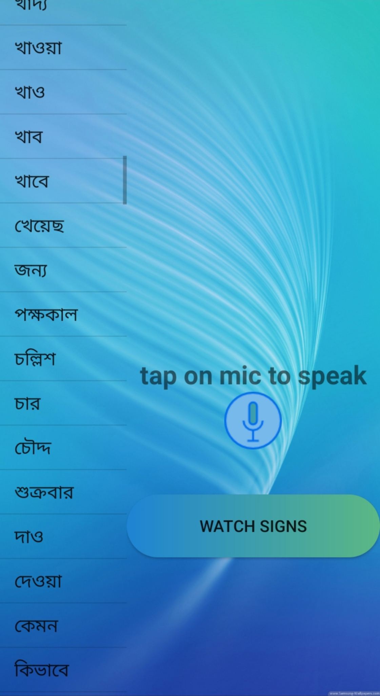
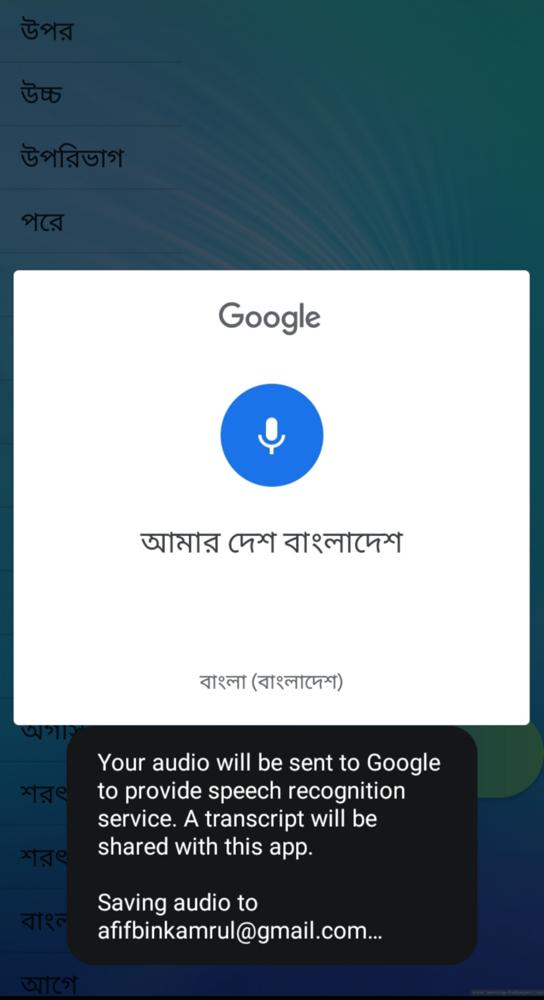
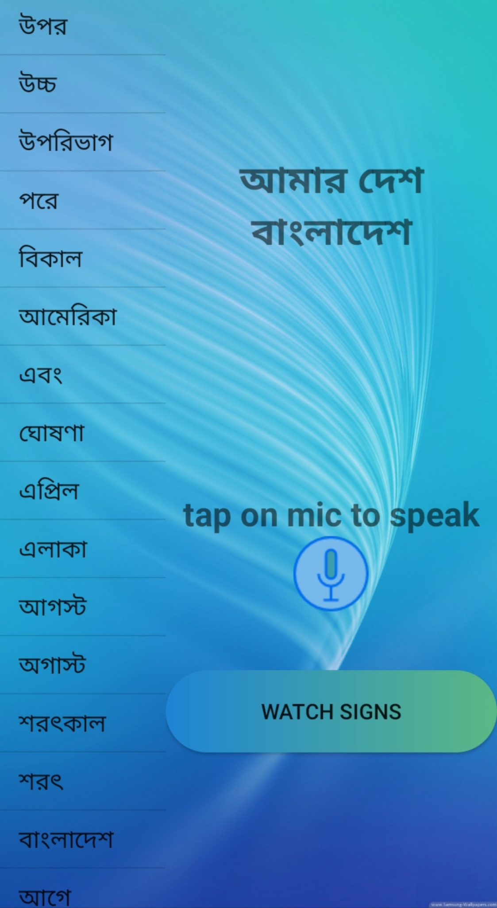
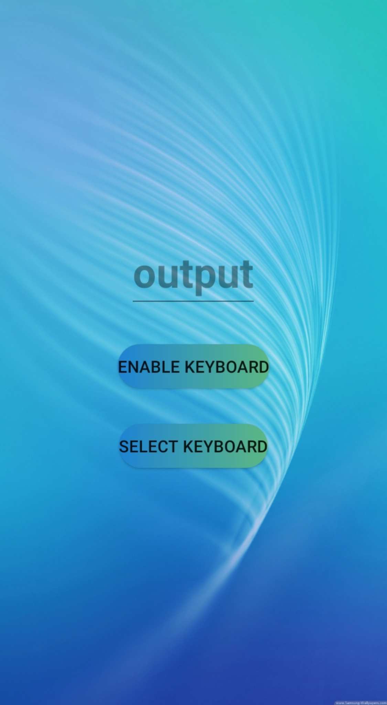
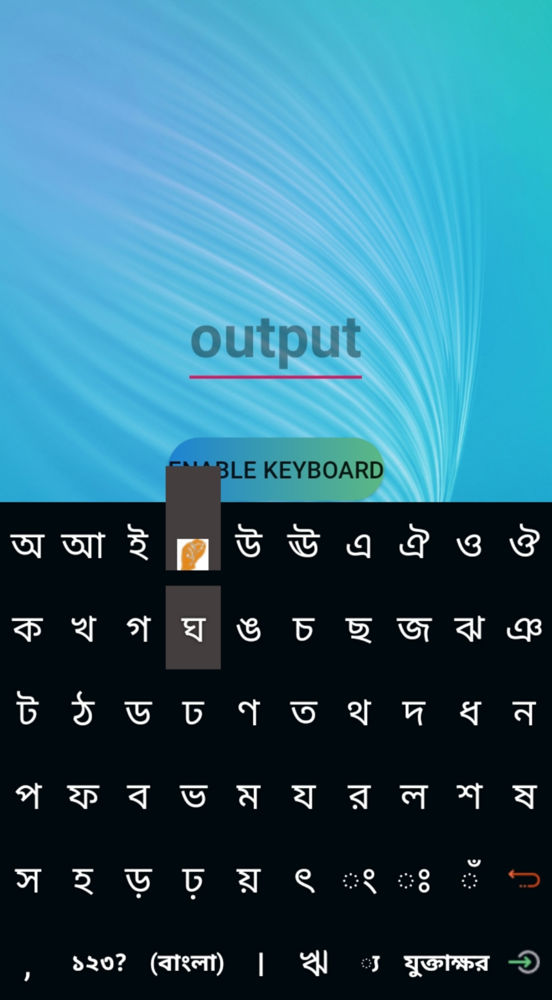
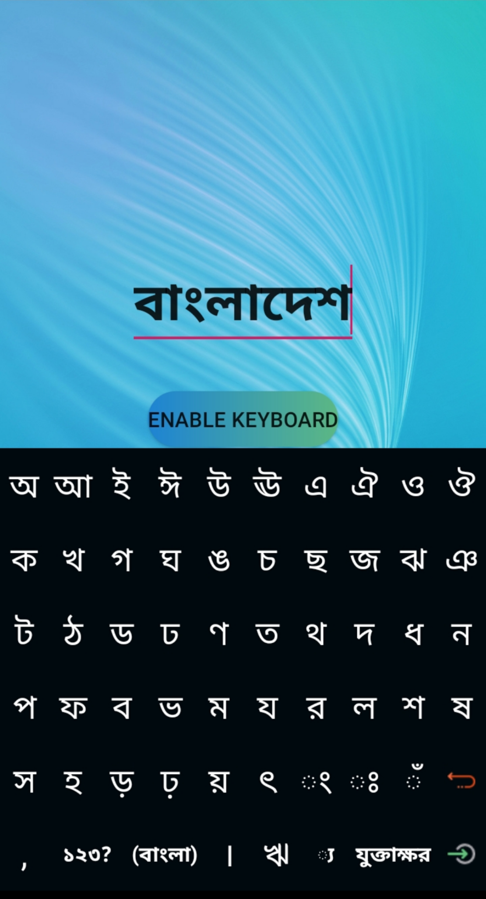

## An Android Communication Platform between Hearing Impaired and General People

- Install Android Studio and open the downloaded or cloned folder.

- This app is developed for Bengali language.

